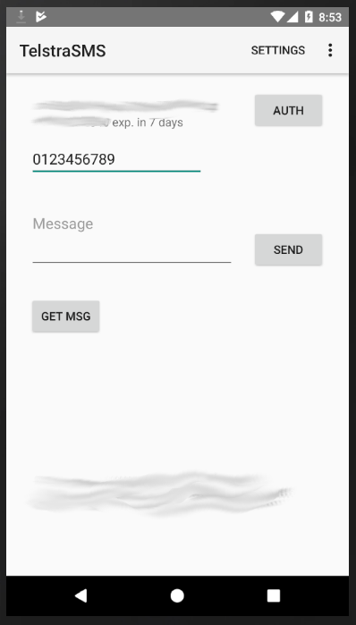

# TelstraSMS
### Android app for the Telstra Messaging API
https://dev.telstra.com/content/messaging-api

Note: very rough release, first venture into Android dev

#### Features
- Authenticate using multiple API keys definable in res/values/array.xml (create this file!)
- Sending messages
- Set [validity & scheduledDelivery options](https://dev.telstra.com/content/messaging-api#operation/Send%20SMS)
- Receiving messages (polling only, retrieve one at a time)

#### array.xml format
```xml
<?xml version="1.0" encoding="utf-8"?>
<resources>
    <string-array name="numbers">
        <item>Phone #1</item>
        <item>Phone #2</item>
        <item>Phone #3</item>
    </string-array>
    <string-array name="api_keys">
        <item>[API_KEY] [API_SECRET]</item>
        <item>... ...</item>
        <item>... ...</item>
    </string-array>
</resources>
```

#### Screenshot

